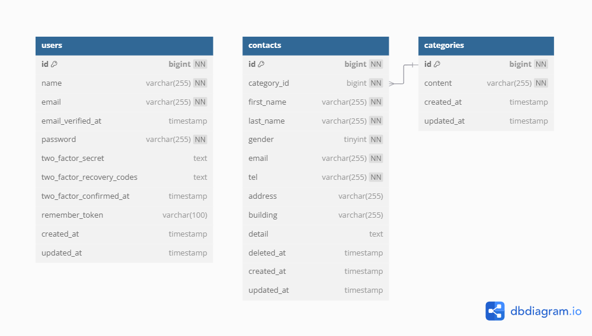

# お問い合わせフォーム

## 環境構築

### Dockerビルド
1. https://github.com/kousukekunitomo/contact-form-app.git
2. `docker-compose up -d --build`

> ※ MySQLがOSによって起動しない場合は、docker-compose.yml をPC環境に応じて調整してください。

### Laravel環境構築
1. `docker-compose exec php bash`
2. `composer install`
3. `.env.example` を `.env` にコピーし、環境変数を設定
4. `php artisan key:generate`
5. `php artisan migrate`
6. `php artisan db:seed`

---

## 使用技術（実行環境）

- PHP 8.0  
- Laravel 10.0  
- MySQL 8.0  
- Docker

---

## URL
- フロント画面（問い合わせフォーム）: http://localhost/
- 管理画面: http://localhost/admin
- phpMyAdmin: http://localhost:8080/

## 認証情報（テスト用）
- ログインユーザー: `admin@example.com`  
- パスワード: `password`

---

## ER図

※ `public/images/er-diagram.png` に画像を配置してください。
